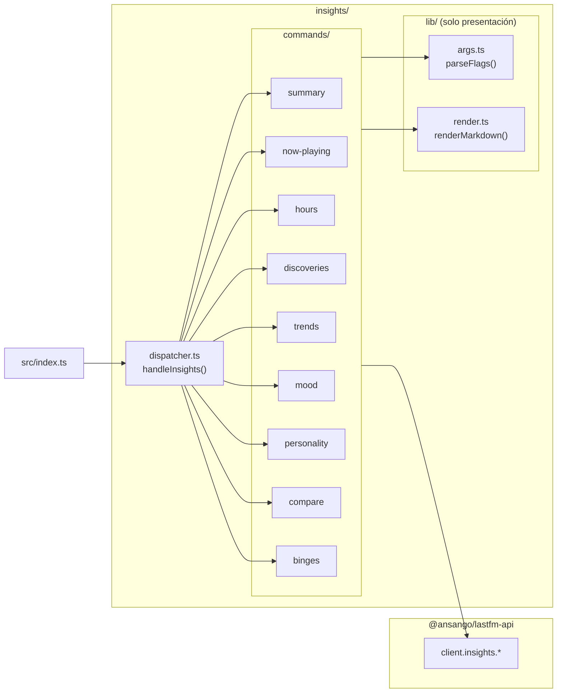

# `insights/` — arquitectura

El namespace `lastfm insights <subcommand>` ofrece nueve vistas derivadas sobre el historial de escucha de un usuario en Last.fm.

Todos los motores analíticos, algoritmos matemáticos (diversidad de Shannon, similitud de Jaccard, clasificación 2D de mood, puntuación de arquetipos) y bucles de paginación son proporcionados directamente por [`@ansango/lastfm-api/insights`](https://github.com/ansango/lastfm-api).

`lastfm-cli` actúa exclusivamente como una **capa de presentación e interfaz de terminal**.

---

## 1. Grafo de módulos

---

## 2. Arquitectura y responsabilidades

1. **`dispatcher.ts`**: Enruta `lastfm insights <subcommand>` hacia el manejador de comando correspondiente.
2. **`commands/<subcommand>.ts`**: Parsea flags CLI mediante `lib/args.ts`, invoca `client.insights.<method>()`, y formatea la salida en Markdown / ASCII charts o JSON hacia `stdout`.
3. **`lib/`**: Contiene exclusivamente utilidades de presentación (`args.ts` para parseo de flags y `render.ts` para transformación a Markdown).
