# `insights/` — arquitectura

El namespace `lastfm insights <subcommand>` ofrece nueve vistas derivadas
sobre el historial de escucha de un usuario de Last.fm. Este documento
explica **cómo está compuesto el código**, no lo que cada insight calcula
para el usuario. Para uso y ejemplos consulta el [README](../../README.md#insights-vistas-derivadas)
principal.

---

## 1. Grafo de módulos

El namespace tiene tres capas: el **dispatcher** enruta `insights <sub>` al
command que corresponde, los **commands** se ocupan del parseo de argv y la
orquestación, y **lib** contiene la lógica pura que componen los commands.

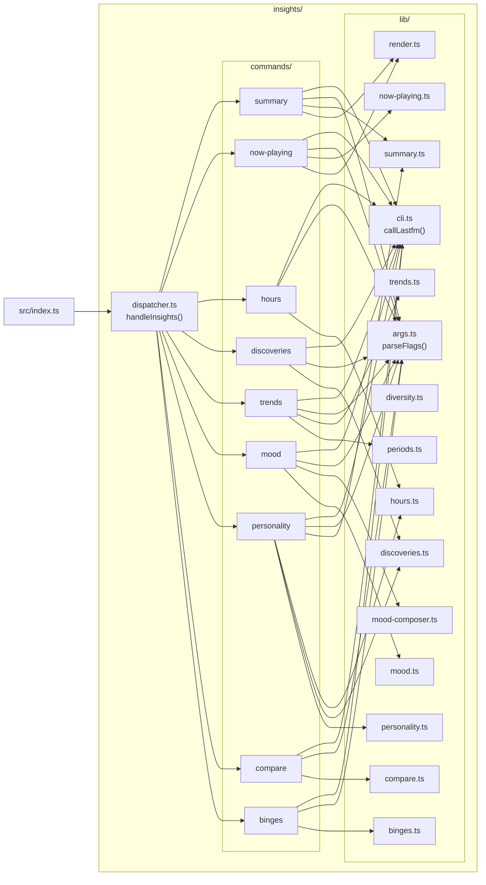

`personality` es el único command que toca tres módulos distintos de lib
(`summary` para diversidad, `hours` para las cuotas por hora del día,
`discoveries` para el contador de artistas nuevos). El resto entra en uno o
dos libs.

---

## 2. Flujo de dispatch (genérico)

Cada subcommand recorre este mismo camino desde argv hasta stdout.
`src/index.ts` captura la palabra clave `insights`, el dispatcher elige el
runner, el command parsea flags, hace fetch vía `callLastfm`, compone con
una función de lib y escribe a stdout.

```mermaid
sequenceDiagram
  autonumber
  participant U as Usuario
  participant CLI as binario lastfm
  participant IDX as src/index.ts
  participant DISP as dispatcher.ts
  participant CMD as commands/&lt;sub&gt;.ts
  participant ARGS as lib/args.ts
  participant C as lib/cli.ts<br/>(callLastfm)
  participant API as @ansango/lastfm-api
  participant LIB as lib/&lt;composer&gt;.ts
  participant OUT as stdout

  U->>CLI: lastfm insights summary --user ansango --period weekly
  CLI->>IDX: argv = ["insights", "summary", ...]
  IDX->>IDX: first === "insights" → handleInsights(argv.slice(1))
  IDX->>DISP: handleInsights(["summary", ...])
  DISP->>DISP: sub = "summary", rest = [...]
  DISP->>CMD: summaryRun(rest)
  CMD->>ARGS: parseFlags(rest, schema)
  ARGS-->>CMD: { values, help: false }
  CMD->>CMD: valida flags requeridas (ej. --user)
  loop por cada llamada a Last.fm
    CMD->>C: callLastfm("user.getTopArtists", params)
    C->>API: spawn lastfm user.getTopArtists ...
    API-->>C: JSON en stdout
    C-->>CMD: payload parseado
  end
  CMD->>LIB: buildSummary({user, period, limit, caller})
  LIB-->>CMD: resultado tipado (Summary / NowPlaying / ...)
  alt format == markdown
    CMD->>CMD: renderMarkdown(result)
  else format == json
    CMD->>CMD: JSON.stringify(result)
  end
  CMD-->>OUT: process.stdout.write
```

`callLastfm` es la única superficie que toca la red — cada función de lib
acepta un `Caller` (o datos ya fetcheados) para que los unit tests puedan
inyectar payloads sintéticos sin spawnear el binario real.

---

## 3. Composición de entidades

La capa lib produce objetos resultado tipados. Cada entidad compone
registros de menor nivel; las flechas de abajo muestran relaciones de
"contiene".

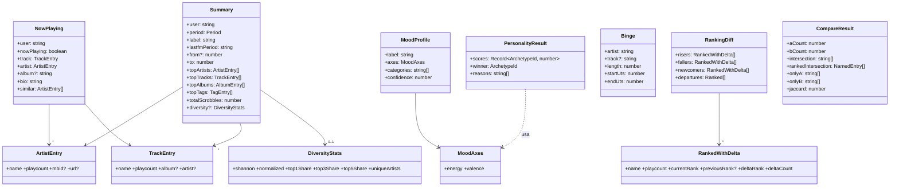

| Entidad | Producida por | Consumida por |
| --- | --- | --- |
| `Summary` | `lib/summary.ts::buildSummary` | `commands/summary.ts`, `commands/personality.ts` (para diversidad + totales) |
| `NowPlaying` | `lib/now-playing.ts::buildNowPlaying` | `commands/now-playing.ts` |
| `PersonalityResult` | `lib/personality.ts::scoreArchetypes` | `commands/personality.ts` |
| `MoodProfile` | `lib/mood.ts::classifyMood` | `lib/mood-composer.ts::buildMoodProfile` |
| `Binge` | `lib/binges.ts::findBinges` | `commands/binges.ts` |
| `RankingDiff` | `lib/trends.ts::diffRankings` | `commands/trends.ts` |
| `CompareResult` | `lib/compare.ts::compareArtists` | `commands/compare.ts` |

---

## 4. Flujos por command

Los diagramas de abajo trazan el camino exacto de cada command: qué métodos
de Last.fm se llaman, en qué orden, qué función de lib compone el resultado
y qué se escribe a stdout. Los bucles de paginación se muestran como `loop`.

### 4.1 `summary`

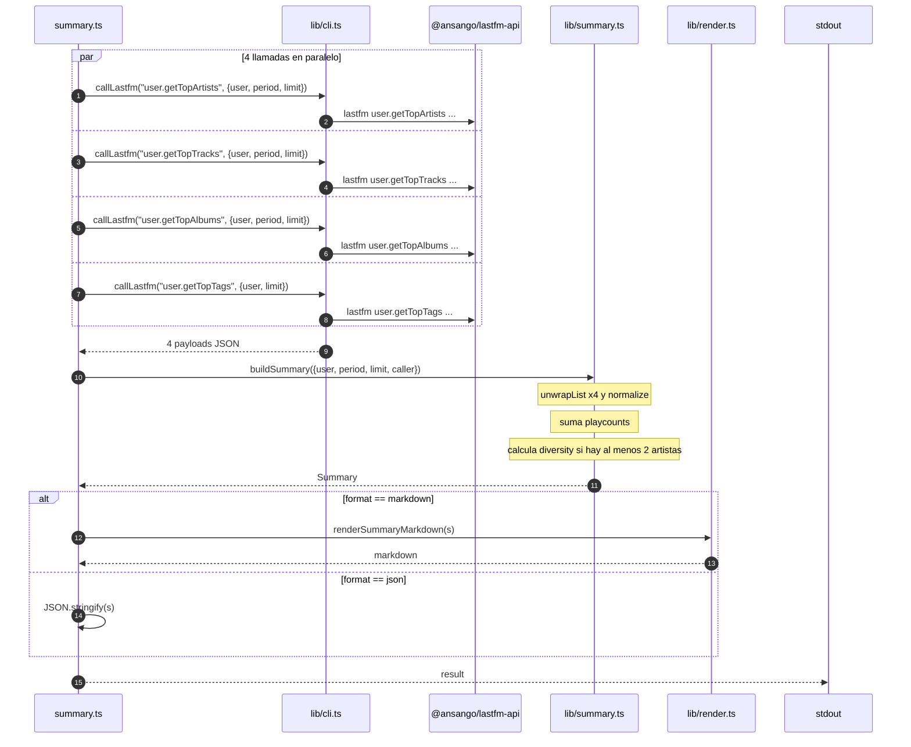

### 4.2 `now-playing`

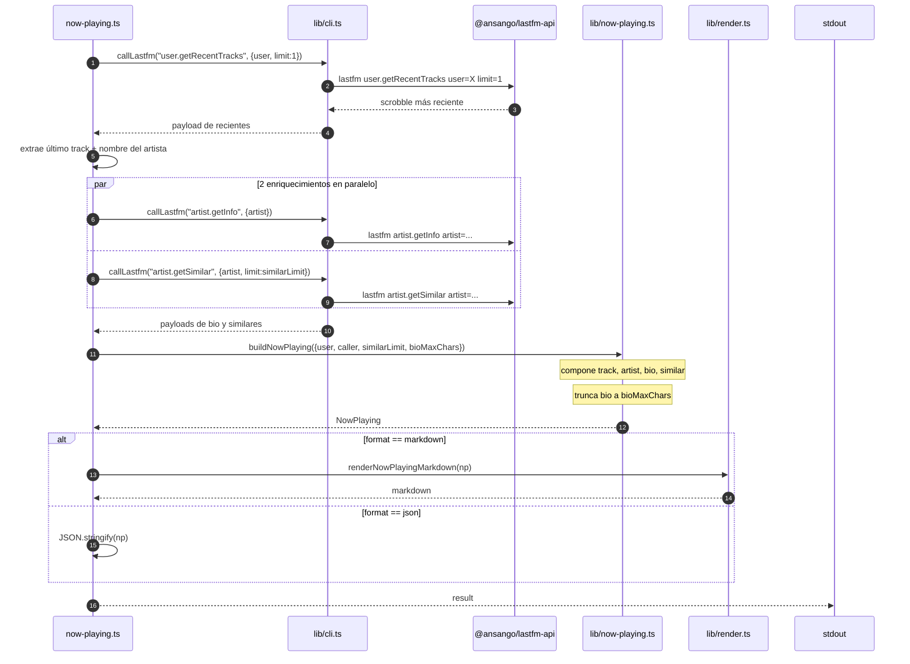

### 4.3 `hours`

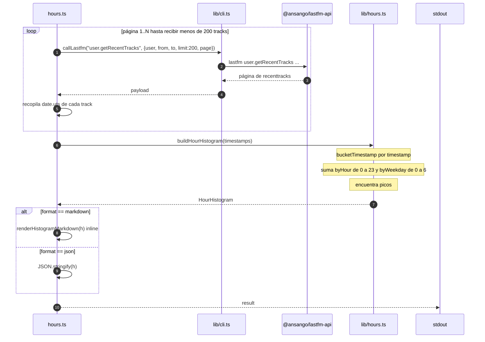

### 4.4 `discoveries`

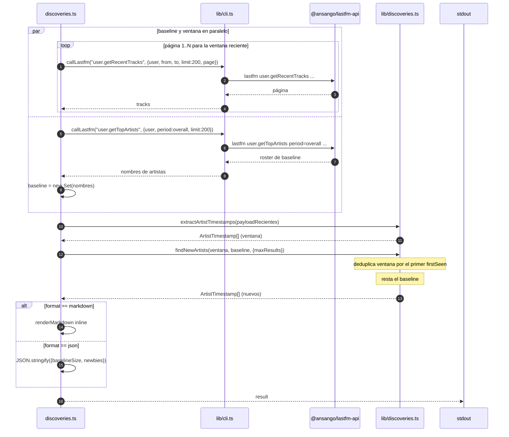

### 4.5 `trends`

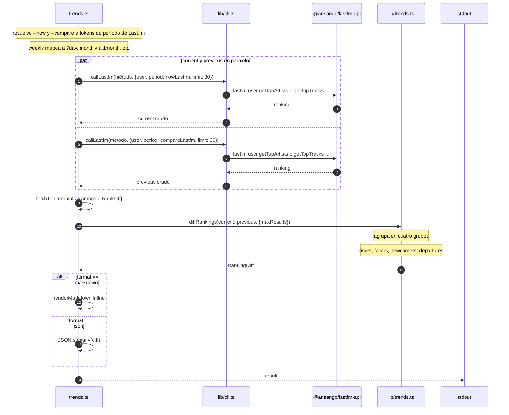

### 4.6 `mood`

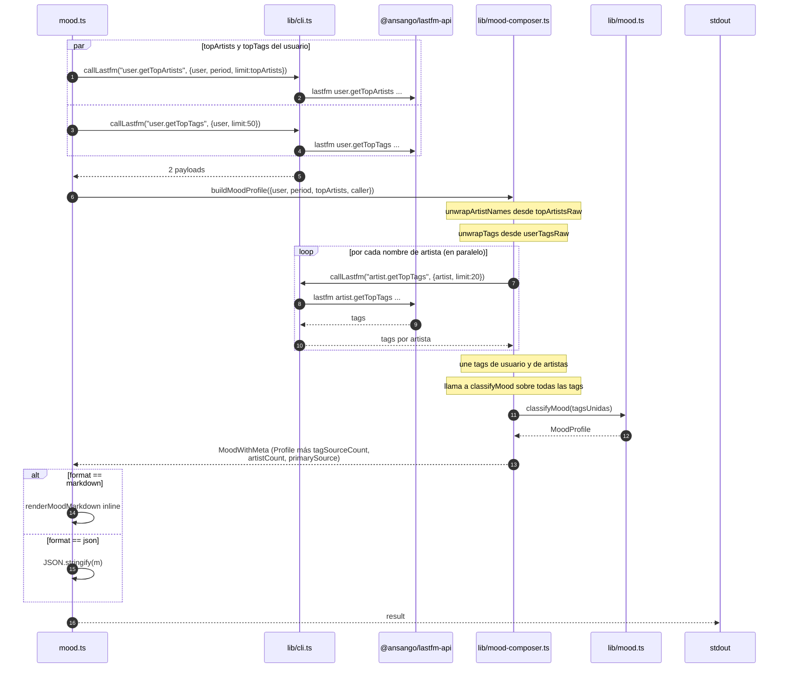

### 4.7 `personality`

El único command que toca tres módulos distintos de lib. Toma diversidad y
totales de `summary`, las cuotas por hora del día de `hours`, y el contador
de artistas nuevos de `discoveries`, y luego alimenta el vector de features
al scorer de personalidad.

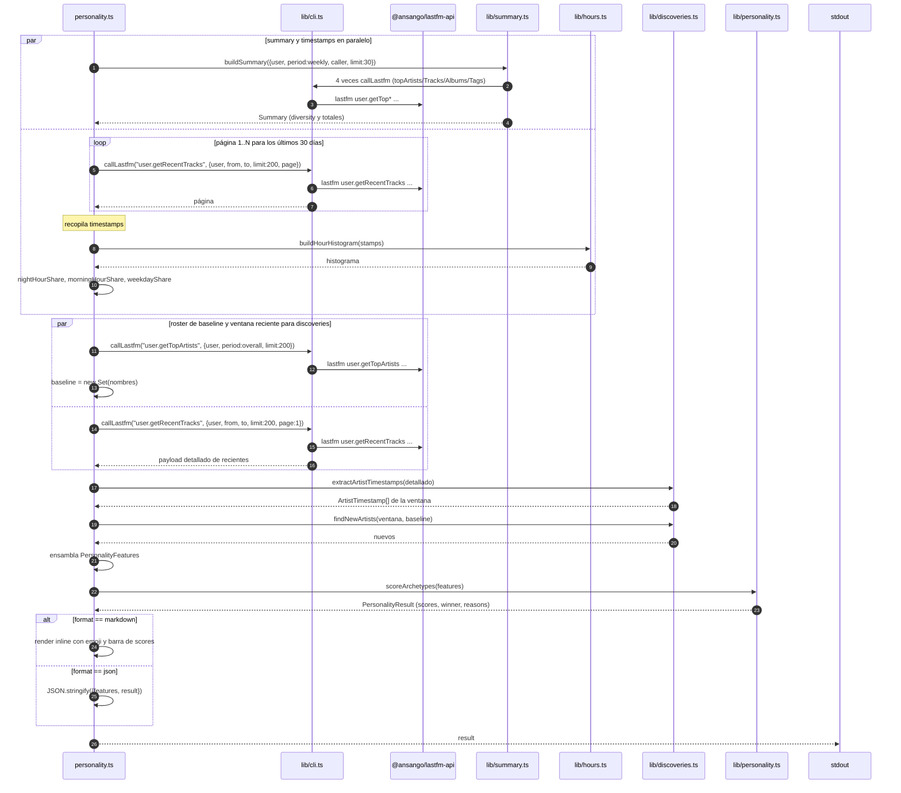

### 4.8 `compare`

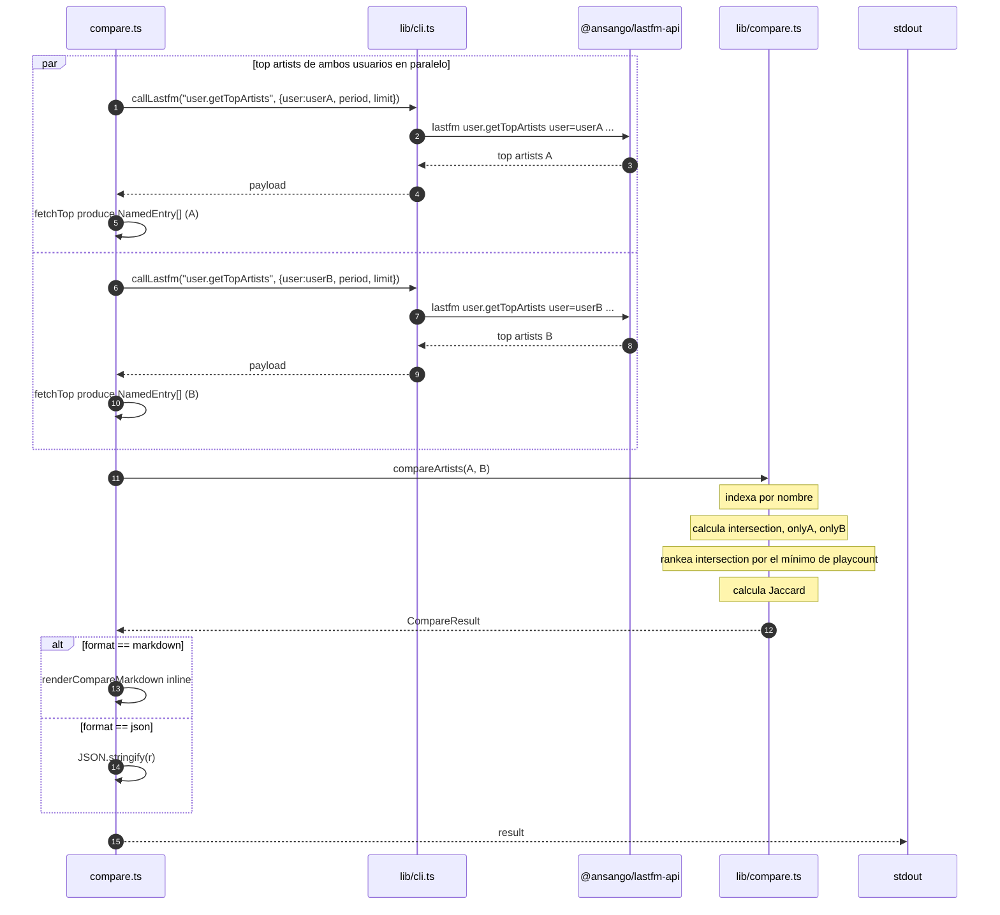

### 4.9 `binges`

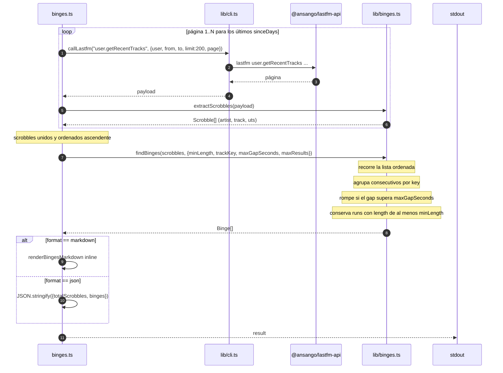

---

## 5. El patrón DI del `Caller`

Cada función de lib que habla con Last.fm acepta un `Caller` en lugar de
llamar al CLI directamente. Esto es lo que hace que los unit tests sean
baratos — producción conecta un `Caller` que envuelve `callLastfm`, los
tests inyectan un fake respaldado por fixtures.

```mermaid
sequenceDiagram
  autonumber
  participant C as commands/&lt;sub&gt;.ts
  participant L as lib/&lt;composer&gt;.ts
  participant X as lib/cli.ts<br/>(callLastfm)
  participant API as binario lastfm

  Note over C,L: Cableado en producción
  C->>C: caller = (m, p) => callLastfm(m, p)
  C->>L: composer({ ..., caller })
  L->>C: caller("user.getTopArtists", {...})
  C->>X: callLastfm("user.getTopArtists", {...})
  X->>API: spawn lastfm user.getTopArtists ...
  API-->>X: JSON en stdout
  X-->>C: payload parseado
  C-->>L: payload

  Note over C,L: Cableado en tests (unit/*.test.ts)
  C->>C: caller = fakeCaller(método) que devuelve JSON literal
  C->>L: composer({ ..., caller: fakeCaller })
  L->>C: caller("user.getTopArtists", {...})
  C-->>L: payload (literal, sin red)
```

El hook `executor` dentro de `callLastfm` (la opción `{ executor }`) es un
segundo punto de inyección — los tests pueden sustituir el propio
`execFile` para verificar el shaping de argumentos sin tocar Last.fm ni el
parseo de `callLastfm`.

---

## 6. Añadir un subcommand nuevo

La forma es mecánica una vez que la conoces. Un nuevo `insights foo`
necesitaría:

1. **`src/insights/lib/foo.ts`** — lógica pura. Exporta el tipo de
   resultado y una o más funciones. Los tests van en
   `tests/insights/lib/foo.test.ts` con un `Caller` respaldado por fixtures.
2. **`src/insights/commands/foo.ts`** — parseo de argv vía `parseFlags`,
   el entry point `run(argv): Promise<void>`, render de markdown inline
   (o añade una función a `lib/render.ts` si el layout es reutilizable).
3. **`src/insights/dispatcher.ts`** — añade `foo` a `INSIGHTS_SUBCOMMANDS`,
   añade `RUNNERS.foo = (a) => fooRun(a)`, y una línea en `insightsHelp()`.
4. **`src/index.ts`** — nada (la rama del dispatcher se ocupa de todos los
   `insights <sub>` automáticamente).
5. **`tests/insights/integration/foo.integration.test.ts`** — gateado por
   `RUN_INTEGRATION=1` + `LASTFM_API_KEY`.
6. **`README.md`** — extiende el bloque de ejemplos `lastfm insights …`.

El script de test (`package.json`) ya hace glob tanto de los tests planos
como de los anidados, así que no hace falta tocar tooling.
