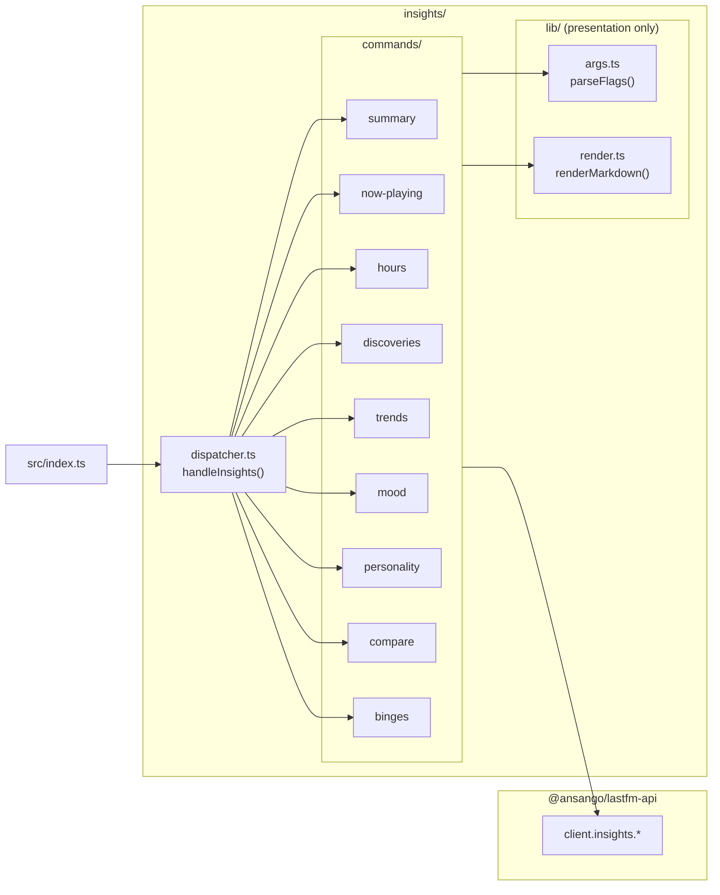

# `insights/` — architecture

The `lastfm insights <subcommand>` namespace ships nine derived views over a user's Last.fm listening history.

All core analytical engines, mathematical algorithms (Shannon diversity, Jaccard similarity, 2D mood classification, archetype scoring), and pagination loops are provided directly by [`@ansango/lastfm-api/insights`](https://github.com/ansango/lastfm-api).

`lastfm-cli` acts purely as a **presentation and terminal interface layer**.

---

## 1. Module graph

---

## 2. Architecture & Responsibilities

1. **`dispatcher.ts`**: Routes `lastfm insights <subcommand>` to the appropriate command handler.
2. **`commands/<subcommand>.ts`**: Parses CLI flags using `lib/args.ts`, calls `client.insights.<method>()`, and writes formatted Markdown / ASCII charts or JSON to `stdout`.
3. **`lib/`**: Contains presentation-only utilities (`args.ts` for flag parsing and `render.ts` for Markdown transformation).
