# `insights/` — architecture

The `lastfm insights <subcommand>` namespace ships nine derived views over a
user's Last.fm listening history. This document explains **how the code is
composed**, not what each insight computes for the user. For usage and
examples see the top-level [README](../../README.md#insights-derived-views).

---

## 1. Module graph

The namespace has three layers: the **dispatcher** routes `insights <sub>` to
the matching command, **commands** own argv parsing + orchestration, and
**lib** holds the pure logic that the commands compose.

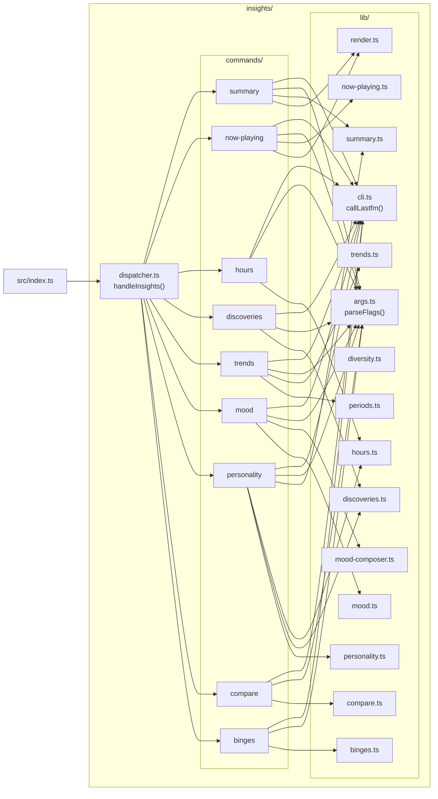

`personality` is the only command that touches three different lib modules
(`summary` for diversity, `hours` for time-of-day shares, `discoveries` for
the new-artists count). Everything else reaches into one or two libs.

---

## 2. Dispatch flow (generic)

Every subcommand walks this same path from argv to stdout. `src/index.ts`
catches the `insights` keyword, the dispatcher picks the runner, the command
parses flags, fetches via `callLastfm`, composes with a lib function, and
writes to stdout.

```mermaid
sequenceDiagram
  autonumber
  participant U as User
  participant CLI as lastfm binary
  participant IDX as src/index.ts
  participant DISP as dispatcher.ts
  participant CMD as commands/&lt;sub&gt;.ts
  participant ARGS as lib/args.ts
  participant C as lib/cli.ts<br/>(callLastfm)
  participant API as @ansango/lastfm-api
  participant LIB as lib/&lt;composer&gt;.ts
  participant OUT as stdout

  U->>CLI: lastfm insights summary --user ansango --period weekly
  CLI->>IDX: argv = ["insights", "summary", ...]
  IDX->>IDX: first === "insights" → handleInsights(argv.slice(1))
  IDX->>DISP: handleInsights(["summary", ...])
  DISP->>DISP: sub = "summary", rest = [...]
  DISP->>CMD: summaryRun(rest)
  CMD->>ARGS: parseFlags(rest, schema)
  ARGS-->>CMD: { values, help: false }
  CMD->>CMD: validate required flags (e.g. --user)
  loop per Last.fm call
    CMD->>C: callLastfm("user.getTopArtists", params)
    C->>API: spawn lastfm user.getTopArtists ...
    API-->>C: JSON stdout
    C-->>CMD: parsed payload
  end
  CMD->>LIB: buildSummary({user, period, limit, caller})
  LIB-->>CMD: typed result (Summary / NowPlaying / ...)
  alt format == markdown
    CMD->>CMD: renderMarkdown(result)
  else format == json
    CMD->>CMD: JSON.stringify(result)
  end
  CMD-->>OUT: process.stdout.write
```

`callLastfm` is the only network-touching surface — every lib function takes a
`Caller` (or pre-fetched data) so unit tests can inject synthetic payloads
without spawning the real binary.

---

## 3. Entity composition

The lib layer produces typed result objects. Each entity composes lower-level
records; arrows below show "contains" relationships.

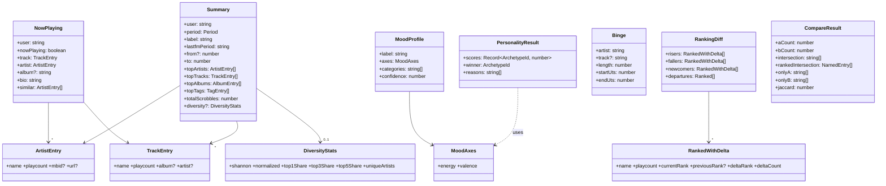

| Entity | Produced by | Consumed by |
| --- | --- | --- |
| `Summary` | `lib/summary.ts::buildSummary` | `commands/summary.ts`, `commands/personality.ts` (for diversity + totals) |
| `NowPlaying` | `lib/now-playing.ts::buildNowPlaying` | `commands/now-playing.ts` |
| `PersonalityResult` | `lib/personality.ts::scoreArchetypes` | `commands/personality.ts` |
| `MoodProfile` | `lib/mood.ts::classifyMood` | `lib/mood-composer.ts::buildMoodProfile` |
| `Binge` | `lib/binges.ts::findBinges` | `commands/binges.ts` |
| `RankingDiff` | `lib/trends.ts::diffRankings` | `commands/trends.ts` |
| `CompareResult` | `lib/compare.ts::compareArtists` | `commands/compare.ts` |

---

## 4. Per-command data flows

The diagrams below trace each command's exact path: which Last.fm methods
are called, in what order, which lib function composes the result, and
what's written to stdout. Pagination loops are shown as `loop`.

### 4.1 `summary`

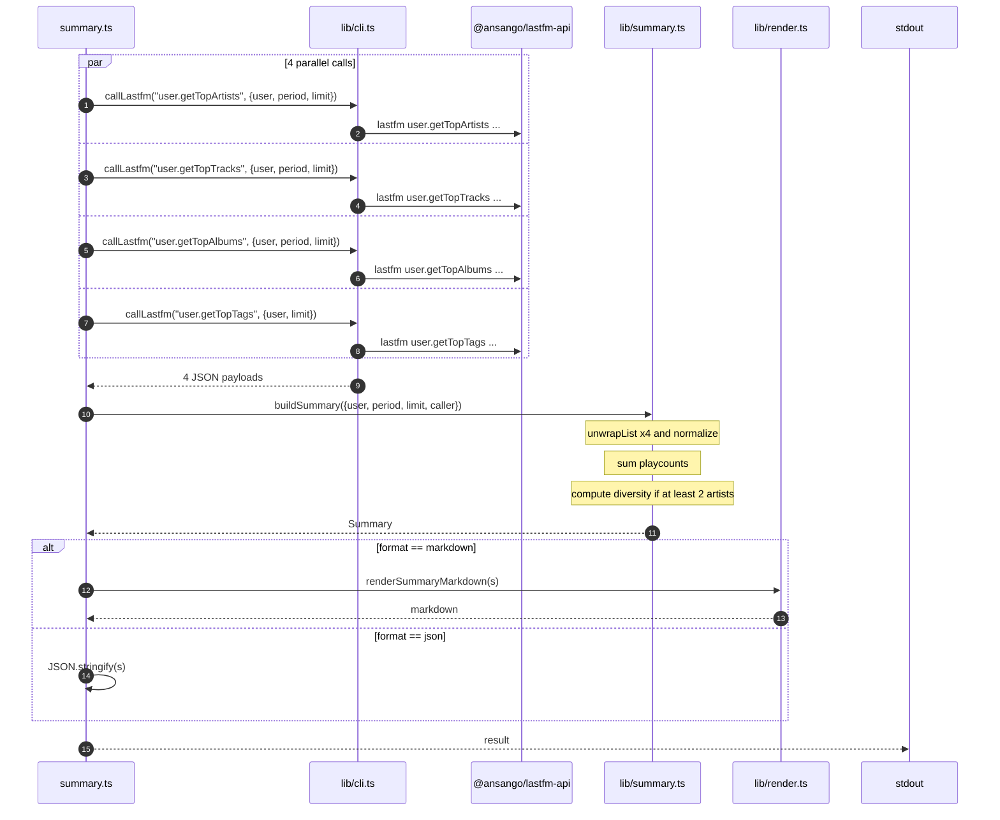

### 4.2 `now-playing`

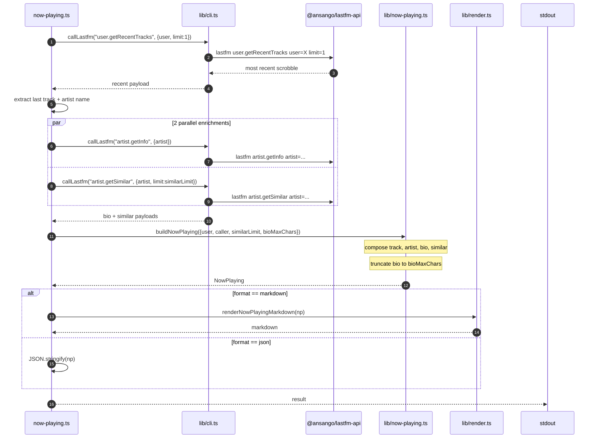

### 4.3 `hours`

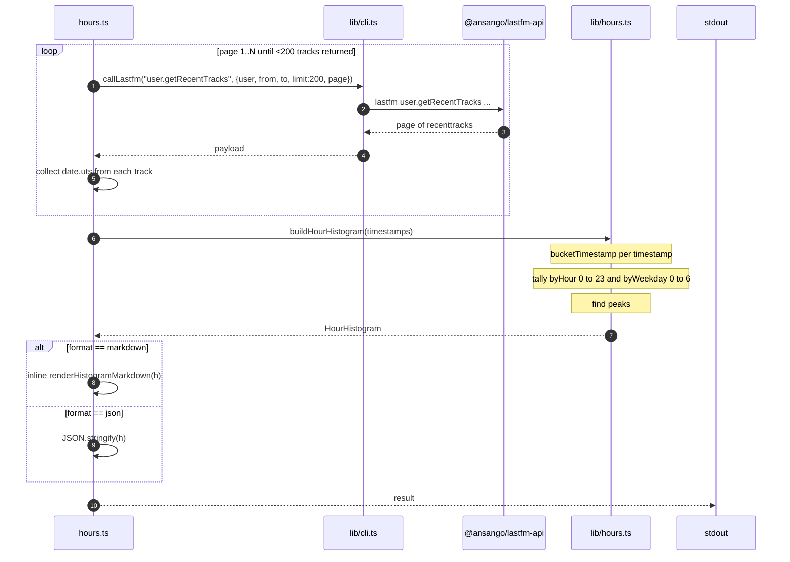

### 4.4 `discoveries`

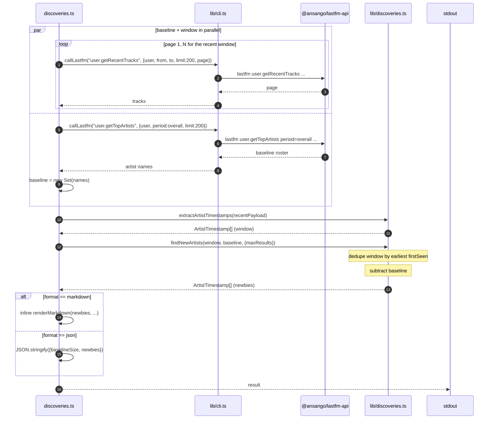

### 4.5 `trends`

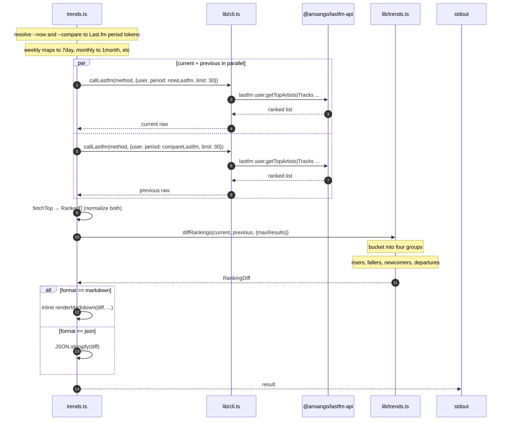

### 4.6 `mood`

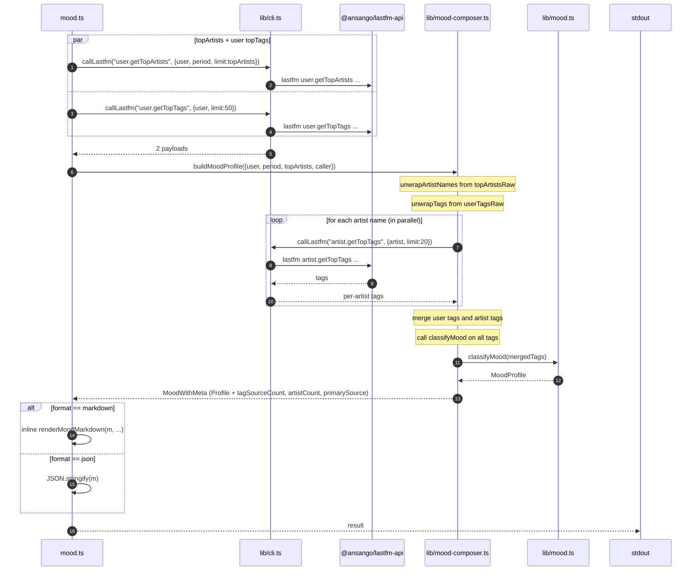

### 4.7 `personality`

The only command that touches three different lib modules. It pulls
diversity + totals from `summary`, time-of-day shares from `hours`, and
new-artists count from `discoveries`, then feeds the assembled feature
vector to the personality scorer.

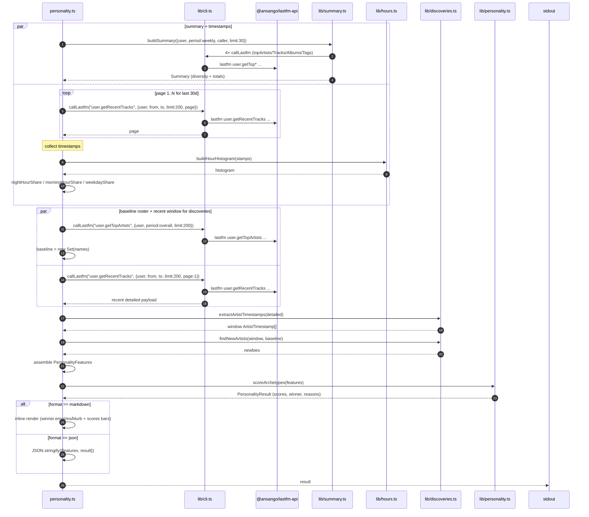

### 4.8 `compare`

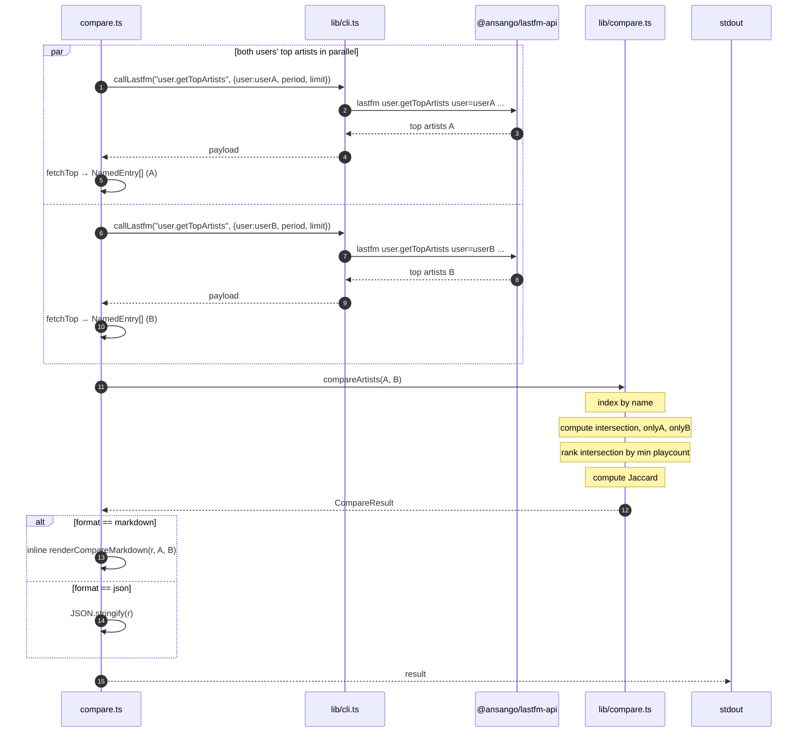

### 4.9 `binges`

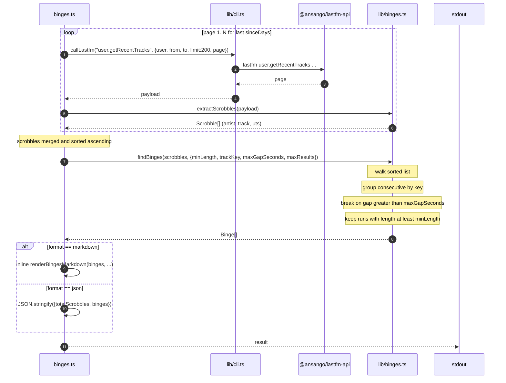

---

## 5. The `Caller` DI pattern

Every lib function that talks to Last.fm takes a `Caller` instead of calling
the CLI directly. This is what makes unit tests cheap — production wires a
`Caller` that wraps `callLastfm`, tests inject a fixture-backed fake.

```mermaid
sequenceDiagram
  autonumber
  participant C as commands/&lt;sub&gt;.ts
  participant L as lib/&lt;composer&gt;.ts
  participant X as lib/cli.ts<br/>(callLastfm)
  participant API as lastfm binary

  Note over C,L: Production wiring
  C->>C: caller = (m, p) => callLastfm(m, p)
  C->>L: composer({ ..., caller })
  L->>C: caller("user.getTopArtists", {...})
  C->>X: callLastfm("user.getTopArtists", {...})
  X->>API: spawn lastfm user.getTopArtists ...
  API-->>X: JSON stdout
  X-->>C: parsed payload
  C-->>L: payload

  Note over C,L: Test wiring (unit/*.test.ts)
  C->>C: caller = fakeCaller(method) → JSON literal
  C->>L: composer({ ..., caller: fakeCaller })
  L->>C: caller("user.getTopArtists", {...})
  C-->>L: payload (literal, no network)
```

The `executor` hook inside `callLastfm` (the `{ executor }` option) is a
second injection point — tests can swap out `execFile` itself to verify
argument shaping without touching Last.fm or even `callLastfm`'s parsing.

---

## 6. Adding a new subcommand

The shape is mechanical once you know it. A new `insights foo` would need:

1. **`src/insights/lib/foo.ts`** — pure logic. Exports the result type and
   one or more functions. Tests live at `tests/insights/lib/foo.test.ts`
   with a fixture-backed `Caller`.
2. **`src/insights/commands/foo.ts`** — argv parsing via `parseFlags`, the
   `run(argv): Promise<void>` entry point, inline markdown rendering (or
   add a function to `lib/render.ts` if the layout is reusable).
3. **`src/insights/dispatcher.ts`** — add `foo` to `INSIGHTS_SUBCOMMANDS`,
   add a `RUNNERS.foo = (a) => fooRun(a)`, and a line in `insightsHelp()`.
4. **`src/index.ts`** — nothing (the dispatcher branch handles all
   `insights <sub>` automatically).
5. **`tests/insights/integration/foo.integration.test.ts`** — gated by
   `RUN_INTEGRATION=1` + `LASTFM_API_KEY`.
6. **`README.md`** — extend the `lastfm insights …` example block.

The test script (`package.json`) globs both flat and nested test paths
already, so no tooling change is needed.
